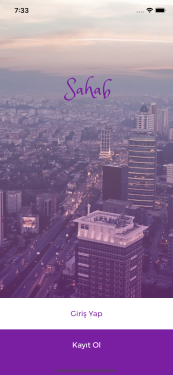
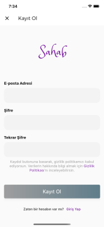
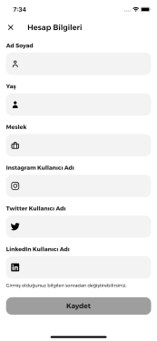
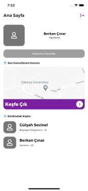
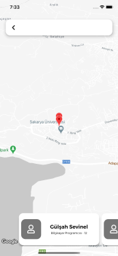
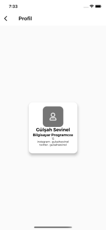

# sahab
Sahab, komşularınızlailetişime geçebileceğiniz, iletişim kurup yaşadığınız çevrenin gelişmesi açısından önerilerde bulup yaşadığınız alanı en iyi hale getirmeye yarayan bir platformdur. Bu platform sayesinde, **topluluklar oluşmasını, bu topluluklar ile yaşadığımız alanın bizim ve gelecek nesiller için en iyi şekilde gelişmeisni hedefliyoruz.**.

Şehirlerin ve toplulukların birbirleriyle etkileşimi hem yaşam kalitesini arttırır hem de üretken ve dinamik şehirlere olanak sağlar.


## kodu çalıştırmak için	
```
flutter clean	
flutter pub get	
flutter run	
```

## ekran görüntüleri
| Giriş Sayfası | KAyıt ol | Hesap Kur | Hesap Kur |
|:-:|:-:|:-:|:-:|
|  |  |  |  |

| Anasayfa | Harita | Profil |
|:-:|:-:|:-:|:-:|
|  |  |  |

